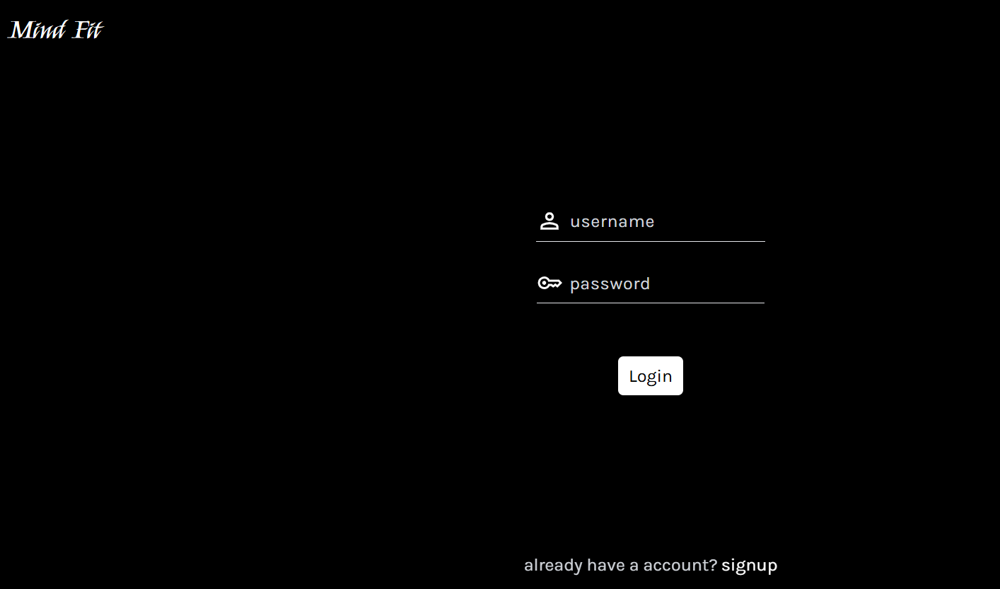
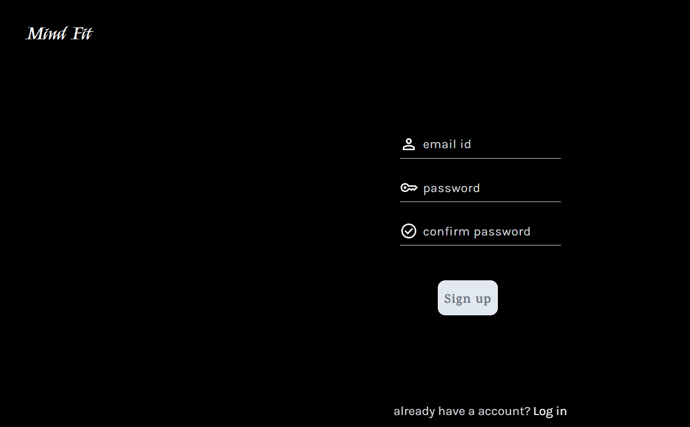

# Mindfit — Campus Health & Wellness Platform

A platform to support student mental and physical well-being, developed during the **Syrus Hackathon**.

---

## 📖 Table of Contents
- [About](#about)
- [Features](#features)
- [Tech Stack](#tech-stack)
- [Project Structure](#project-structure)
- [Installation](#installation)
- [Usage](#usage)
- [Screenshots](#screenshots)
- [Contributing](#contributing)
- [License](#license)

---

## 💡 About

**Mindfit** is a Campus Health & Wellness Platform built to support students' mental and physical well-being with real-time features.  
It enables live counseling sessions, activity tracking, and proactive wellness monitoring.

---

## ✨ Features

- 🔐 Secure JWT token-based login system
- 🎥 Live counseling sessions using WebRTC
- 📞 Twilio API integration for alerts and notifications
- 🏃 Google Fit API integration for physical activity tracking
- 📺 Curated mental wellness videos and resources
- 💬 Peer and mentor/counsellor support (planned)
- 🧠 Mood tracking and progress monitoring (planned)
- 👤 Profile management
- 📊 Dashboard for an overview of mental well-being

---

## 🛠 Tech Stack

- **Frontend**: React.js  
- **Backend**: Node.js, Express.js  
- **Database**: MongoDB  
- **APIs & Services**: WebRTC, Twilio API, Google Fit API  
- **Other**: Various media assets (images, videos, etc.)

---

## 📁 Project Structure

```
Mindfit-student-mental-wellbeing-platfrom/
├── Images/               # Static media assets
├── authentication/       # Login / Register related code
├── server/                # Backend server logic (Node.js)
├── videos/                # Wellness video content
├── package.json
├── package-lock.json
└── README.md
```

---

## ⚙️ Installation

Follow these steps to set up the project locally:

1. **Clone the repository**
   ```bash
   git clone https://github.com/nimishchug3/Mindfit-student-mental-wellbeing-platfrom.git
   cd Mindfit-student-mental-wellbeing-platfrom
   ```

2. **Install dependencies**
   ```bash
   npm install
   ```

3. **Configure environment variables**
   - Create a `.env` file in the root directory
   - Add necessary environment variables (e.g., DB connection URL, API keys)

4. **Start the server**
   ```bash
   npm run dev
   ```
   or
   ```bash
   node server/index.js
   ```

---

## ▶️ Usage

- Open the app at: `http://localhost:PORT`
- Register or log in as a user
- Explore the dashboard
- Access mental wellness content and other features

---

## 📸 Screenshots

### 🔐 Login Page


### 📝 Signup Page


### 🏠 Home Page


---

## 🧠 Authors

- [Nimish Chug](https://github.com/nimishchug3)
- [Vedang Gambhire]
- [Pankaj Pawar]
- [Sujal]
